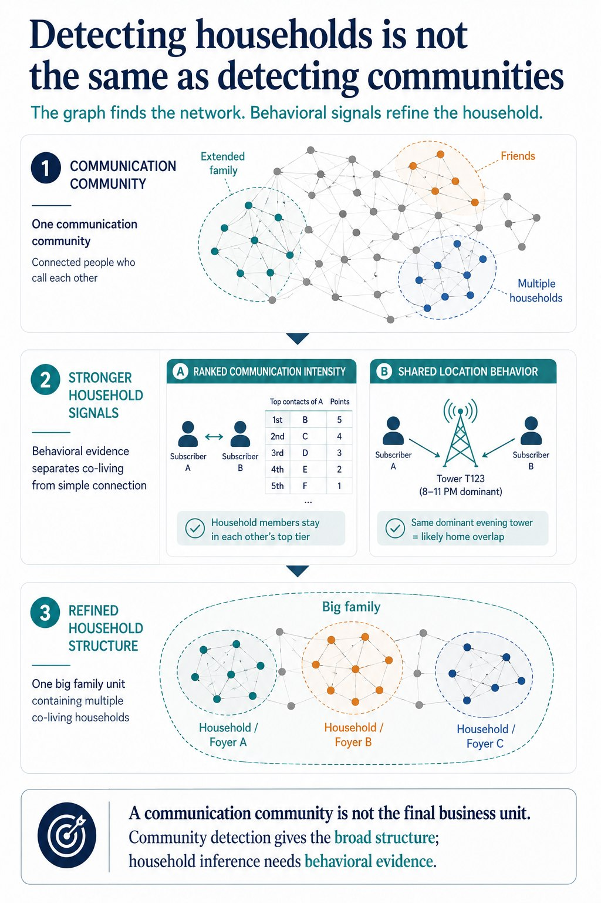

# Telecom Household Inference

A graph analytics project showing how telecom communication communities can be refined into household-level groups using ranked contact behavior, shared cell-tower usage, and graph partitioning.

## Project Website

[View Project Site](https://mah-trigui.github.io/telecom-household-inference/)

## Overview

This project started from precomputed communication communities derived from telecom call graph analysis.

At first glance, a communication community looks like the answer: a group of people who call each other frequently.

But for the business problem, that output was still too coarse.

The real goal was to identify likely **household-level ties** inside broader communication communities.

A single telecom community can contain:
- extended family
- multiple households
- close friends
- other tightly connected subgroups

So instead of treating the graph output as the final answer, the pipeline refined it into nested social structure:
1. broader **big family** groups
2. smaller **foyer / household** groups

## Core Modeling Pattern

Before asking:
- who belongs to the same household

the pipeline first asks:
- which larger communication communities contain family-like structure?
- which ties inside those communities also look like daily-life proximity?

This turns the problem into a multi-stage behavioral inference pipeline:
1. communication community filtering
2. ranked contact feature construction
3. shared location behavior extraction
4. big-family grouping
5. household-level graph partitioning

## Architecture



<details>
<summary>📋 View detailed text-based architecture diagram</summary>

```text
                ┌─────────────────────────────────────────────┐
                │ Telecom Communication Communities           │
                │ precomputed CLA community assignments       │
                └──────────────────────┬──────────────────────┘
                                       │
                                       ▼
                ┌─────────────────────────────────────────────┐
                │ Community Filtering                         │
                │ keep communities with enough TT members     │
                └──────────────────────┬──────────────────────┘
                                       │
                                       ▼
                ┌─────────────────────────────────────────────┐
                │ Ranked Contact Layer                        │
                │ top incoming / outgoing contacts per user   │
                │ ranked by calls, days, and duration         │
                └──────────────────────┬──────────────────────┘
                                       │
                                       ▼
                ┌─────────────────────────────────────────────┐
                │ Shared Cell Behavior Layer                  │
                │ top-used cell towers per subscriber         │
                │ retain overlapping dominant towers          │
                └──────────────────────┬──────────────────────┘
                                       │
                                       ▼
                ┌─────────────────────────────────────────────┐
                │ Candidate Family Tie Construction           │
                │ communication closeness + shared location   │
                └──────────────────────┬──────────────────────┘
                                       │
                                       ▼
                ┌─────────────────────────────────────────────┐
                │ Big Family Construction                     │
                │ broader connected family-like groups        │
                └──────────────────────┬──────────────────────┘
                                       │
                                       ▼
                ┌─────────────────────────────────────────────┐
                │ Foyer / Household Partitioning              │
                │ graph-based grouping in R / igraph          │
                └──────────────────────┬──────────────────────┘
                                       │
                                       ▼
                ┌─────────────────────────────────────────────┐
                │ Final Household-Level Output                │
                │ msisdn, community, big_family, foyer, role  │
                └─────────────────────────────────────────────┘
